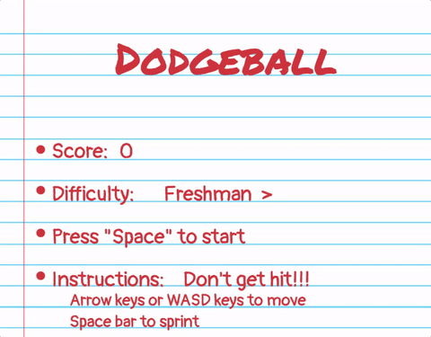

# Dodgeball

### Live Site
<http://MeirGalimidi.com/dodgeball>

## Game View


## Overview
Dodge the incoming dodgeballs for as long as you can. The chance of a ball being thrown gradually increases with time. Hold down the arrow keys, or WASD keys to control your character, and use the spacebar too in order to double your speed.   

## Technologies
* Javascript
* Canvas
* HTML5
* SCSS

## Technical Implementations

### Difficulty and variety
* In order to have varying difficulty and variety, the dodgeball spawn rate is adjustable. The number of dodgeballs that can be spawned per frame are set by the difficulty selected by the user with the arrow keys on the homescreen. The chance that a ball is spawned that frame is automatically adjusted per frame by 0.00001%. This percent chance is displayed to the user in rounded form, as the level.




* When spawned, dodgeballs are set to the same dx speed as the standard speed of the Player. Their dy speed is set to randomly generated single digit number between 0 and 5. This ensures a more focused forward movement, and can be used as a point adjusted for future tweaks to difficulty. The y-cord is set to random percentage of canvas height.


* The dodgeball interactions are set to only transfer dy speed. It provides a more avoidable, predictable environment for the Player. In order to minimize traveling entanglements, the game runs at 64 frames a second [1]. In order to minimize spawn entanglements, a collision check is run before placement, and skipped if a collision is eminent.

```ruby
collideWith(otherObject) {
  if (otherObject instanceof player) {
    otherObject.relocate()
    return true
  } else {
      const thisVelY = this.vel[1]
      const otherVelY = otherObject.vel[1]
      this.vel[1] = otherVelY
      otherObject.vel[1] = thisVelY
    }
}
```

* The spacebar is used to double the players speed. This allows a bit more variety in gameplay, and can be the basis for future item interactions with player speed.

```ruby
collideWith(otherObject) {
  if (otherObject instanceof player) {
    otherObject.relocate()
    return true
  } else {
			const thisVelY = this.vel[1]
			const otherVelY = otherObject.vel[1]
			this.vel[1] = otherVelY
			otherObject.vel[1] = thisVelY
		}
  }
```


* The first second after a death, controls are disabled so a player does not accidentally start a new game or adjust the difficulty due to pressing the controls to play.

[1] If the general speed of the game is increased this will be revisited.
